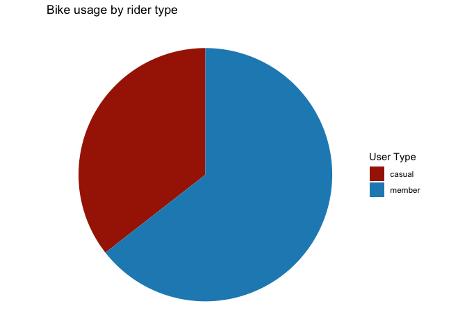
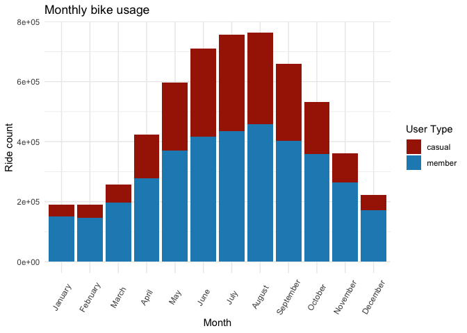
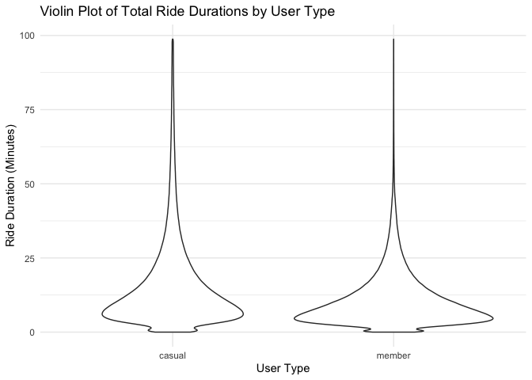

Bike Share DA
================
Aditi Nagaraj Nallan
2023-10-18

Load the required R packages

``` r
suppressPackageStartupMessages(library(tidyverse))
library(lubridate)
library(MetBrewer)
```

## Initial exploration of rider data for September, 2023

Load the September dataset and check for the structure and datatype:

    ## Rows: 666371 Columns: 13
    ## ── Column specification ────────────────────────────────────────────────────────
    ## Delimiter: ","
    ## chr  (7): ride_id, rideable_type, start_station_name, start_station_id, end_...
    ## dbl  (4): start_lat, start_lng, end_lat, end_lng
    ## dttm (2): started_at, ended_at
    ## 
    ## ℹ Use `spec()` to retrieve the full column specification for this data.
    ## ℹ Specify the column types or set `show_col_types = FALSE` to quiet this message.

Now, check for the number rows and columns in the data and inspect other
data attributes

``` r
colnames(September_data)
```

    ##  [1] "ride_id"            "rideable_type"      "started_at"        
    ##  [4] "ended_at"           "start_station_name" "start_station_id"  
    ##  [7] "end_station_name"   "end_station_id"     "start_lat"         
    ## [10] "start_lng"          "end_lat"            "end_lng"           
    ## [13] "member_casual"

``` r
dim(September_data)
```

    ## [1] 666371     13

``` r
str(September_data)
```

    ## spc_tbl_ [666,371 × 13] (S3: spec_tbl_df/tbl_df/tbl/data.frame)
    ##  $ ride_id           : chr [1:666371] "011C1903BF4E2E28" "87DB80E048A1BF9F" "7C2EB7AF669066E3" "57D197B010269CE3" ...
    ##  $ rideable_type     : chr [1:666371] "classic_bike" "classic_bike" "electric_bike" "classic_bike" ...
    ##  $ started_at        : POSIXct[1:666371], format: "2023-09-23 00:27:50" "2023-09-02 09:26:43" ...
    ##  $ ended_at          : POSIXct[1:666371], format: "2023-09-23 00:33:27" "2023-09-02 09:38:19" ...
    ##  $ start_station_name: chr [1:666371] "Halsted St & Wrightwood Ave" "Clark St & Drummond Pl" "Financial Pl & Ida B Wells Dr" "Clark St & Drummond Pl" ...
    ##  $ start_station_id  : chr [1:666371] "TA1309000061" "TA1307000142" "SL-010" "TA1307000142" ...
    ##  $ end_station_name  : chr [1:666371] "Sheffield Ave & Wellington Ave" "Racine Ave & Fullerton Ave" "Racine Ave & 15th St" "Racine Ave & Belmont Ave" ...
    ##  $ end_station_id    : chr [1:666371] "TA1307000052" "TA1306000026" "13304" "TA1308000019" ...
    ##  $ start_lat         : num [1:666371] 41.9 41.9 41.9 41.9 41.9 ...
    ##  $ start_lng         : num [1:666371] -87.6 -87.6 -87.6 -87.6 -87.6 ...
    ##  $ end_lat           : num [1:666371] 41.9 41.9 41.9 41.9 41.9 ...
    ##  $ end_lng           : num [1:666371] -87.7 -87.7 -87.7 -87.7 -87.7 ...
    ##  $ member_casual     : chr [1:666371] "member" "member" "member" "member" ...
    ##  - attr(*, "spec")=
    ##   .. cols(
    ##   ..   ride_id = col_character(),
    ##   ..   rideable_type = col_character(),
    ##   ..   started_at = col_datetime(format = ""),
    ##   ..   ended_at = col_datetime(format = ""),
    ##   ..   start_station_name = col_character(),
    ##   ..   start_station_id = col_character(),
    ##   ..   end_station_name = col_character(),
    ##   ..   end_station_id = col_character(),
    ##   ..   start_lat = col_double(),
    ##   ..   start_lng = col_double(),
    ##   ..   end_lat = col_double(),
    ##   ..   end_lng = col_double(),
    ##   ..   member_casual = col_character()
    ##   .. )
    ##  - attr(*, "problems")=<externalptr>

From the output above we see that, there are a total of 666371 rows and
13 columns. Of these 13, 7 are type character and 4 are type double.
Let’s now ensure that the two columns **started_at** and **ended_at**
are date_time type to correctly represent the contents of the column.

``` r
September_data$started_at = lubridate::as_datetime(September_data$started_at)
September_data$ended_at = lubridate::as_datetime(September_data$ended_at)

#Check to see if the column type is correct
class(September_data$started_at)
```

    ## [1] "POSIXct" "POSIXt"

``` r
class(September_data$ended_at)
```

    ## [1] "POSIXct" "POSIXt"

In the next step, let us check for any missing values or duplicated ride
ids in the data and count how many of these are present!

``` r
colSums(is.na(September_data))
```

    ##            ride_id      rideable_type         started_at           ended_at 
    ##                  0                  0                  0                  0 
    ## start_station_name   start_station_id   end_station_name     end_station_id 
    ##             101312             101312             107291             107291 
    ##          start_lat          start_lng            end_lat            end_lng 
    ##                  0                  0                838                838 
    ##      member_casual 
    ##                  0

``` r
sum(duplicated(September_data$ride_id))
```

    ## [1] 0

From the output above we see that there are no duplicated values. As for
the missing values, 6 columns contain missing values. However, four of
these columns are irrelevant to our analysis and will thus be dropped in
the subsequent section. The other two columns (**start_station_name**
and **end_station_name**) will be retained with missing data to ensure
that we don’t statistically skew the data. These columns will be later
used to understand which bike pick up and drop off points are most
popular in the city among casual users and members.

``` r
#Let us drop the unwanted columns:
September_data = subset(September_data, select = -c(start_station_id, end_station_id, start_lat, start_lng, end_lat, end_lng))
```

Let us now use the two columns **started_at** and **ended_at** to
calculate **ride_length** and add this new column to the dataframe.

``` r
ride_length = as.numeric(difftime(September_data$ended_at,September_data$started_at, units = "secs"))
September_data$ride_duration = sprintf("%02d:%02d:%02d",
                                    ride_length %/% 3600,
                                    (ride_length %% 3600) %/% 60,
                                    ride_length %% 60)
```

Let us also find the **day_of_week** these rides were booked and add
this new column to the dataframe:

``` r
September_data$day_of_week = wday(September_data$started_at,label = TRUE)
```

Finally, let us extract ride duration in minutes to perform calculations
and add the new column **ride_duration_minutes** to the dataframe.

``` r
#First write a function to convert the HH:MM:SS format and extract total minutes: 
hhmmss_to_minutes = function(time_string) {
  parts = unlist(strsplit(time_string, ":"))
  if (length(parts) == 3) {
    hours = as.numeric(parts[1])
    minutes = as.numeric(parts[2])
    seconds = as.numeric(parts[3])
    total_minutes = (hours * 60) + minutes + (seconds / 60)
    return(total_minutes)
  } else {
    return(NA)
  }
}

# Apply the conversion function to the ride_duration column
September_data$ride_duration_minutes = sapply(September_data$ride_duration, hhmmss_to_minutes)
```

We see that there are some ride duration with negative values. Let us
first start by removing them as these correspond to the time when bikes
were taken out from the docks for routine checking:

``` r
September_data = September_data[!(September_data$ride_duration_minutes<0),]
```

## Descriptive Analysis

Now that we have appropriately prepared the data for analysis, let us
conduct a descriptive analysis:

``` r
summary(September_data$ride_duration_minutes)
```

    ##    Min. 1st Qu.  Median    Mean 3rd Qu.    Max. 
    ##    0.00    5.85   10.18   17.87   17.93 1507.77

We see that the mean ride duration was around 18 minutes! Let us now
compare the mean ride duration between the members and casual users:

``` r
aggregate(September_data$ride_duration_minutes ~ September_data$member_casual, FUN= mean)
```

    ##   September_data$member_casual September_data$ride_duration_minutes
    ## 1                       casual                             25.18711
    ## 2                       member                             13.14542

From the table above we see that casual users tend to ride the bikes
longer than Cyclistic members. Let us also see the average ride times by
each day for members versus casual users:

``` r
aggregate(September_data$ride_duration_minutes ~September_data$member_casual + September_data$day_of_week, FUN=mean)
```

    ##    September_data$member_casual September_data$day_of_week
    ## 1                        casual                        Sun
    ## 2                        member                        Sun
    ## 3                        casual                        Mon
    ## 4                        member                        Mon
    ## 5                        casual                        Tue
    ## 6                        member                        Tue
    ## 7                        casual                        Wed
    ## 8                        member                        Wed
    ## 9                        casual                        Thu
    ## 10                       member                        Thu
    ## 11                       casual                        Fri
    ## 12                       member                        Fri
    ## 13                       casual                        Sat
    ## 14                       member                        Sat
    ##    September_data$ride_duration_minutes
    ## 1                              30.30098
    ## 2                              14.77300
    ## 3                              25.99368
    ## 4                              12.46464
    ## 5                              19.61424
    ## 6                              12.17850
    ## 7                              19.48360
    ## 8                              12.40372
    ## 9                              20.69431
    ## 10                             12.42570
    ## 11                             24.11785
    ## 12                             13.21094
    ## 13                             28.16801
    ## 14                             14.47550

From the table above we see that on an average, casual users tend to
ride the bikes longer than Cyclistic members on any given day.

Next let’s analyse ridership data by type and weekday:

``` r
September_data %>% 
  mutate(weekday = wday(started_at, label = TRUE)) %>%  
  group_by(member_casual, weekday) %>%  
  summarise(number_of_rides = n()                           
  ,average_duration = mean(ride_duration_minutes)) %>%      
  arrange(member_casual, weekday)                               
```

    ## `summarise()` has grouped output by 'member_casual'. You can override using the
    ## `.groups` argument.

    ## # A tibble: 14 × 4
    ## # Groups:   member_casual [2]
    ##    member_casual weekday number_of_rides average_duration
    ##    <chr>         <ord>             <int>            <dbl>
    ##  1 casual        Sun               44386             30.3
    ##  2 casual        Mon               26114             26.0
    ##  3 casual        Tue               22868             19.6
    ##  4 casual        Wed               26178             19.5
    ##  5 casual        Thu               28172             20.7
    ##  6 casual        Fri               45482             24.1
    ##  7 casual        Sat               68403             28.2
    ##  8 member        Sun               45302             14.8
    ##  9 member        Mon               43543             12.5
    ## 10 member        Tue               53065             12.2
    ## 11 member        Wed               60812             12.4
    ## 12 member        Thu               61968             12.4
    ## 13 member        Fri               70638             13.2
    ## 14 member        Sat               69390             14.5

From the summary table we see that Saturday had the highest number of
rides booked in the month of September. The average ride duration was
also highest on Saturday and Sunday compared to the weekdays.

Now that we have looked at one month’s trend, let us extrapolate our
analysis to all months in the year 2023 and see how these trends vary
across different months-

## Expansion of analysis across multiple months

### Step 1: Data Collection

    ## Rows: 190301 Columns: 13
    ## ── Column specification ────────────────────────────────────────────────────────
    ## Delimiter: ","
    ## chr  (7): ride_id, rideable_type, start_station_name, start_station_id, end_...
    ## dbl  (4): start_lat, start_lng, end_lat, end_lng
    ## dttm (2): started_at, ended_at
    ## 
    ## ℹ Use `spec()` to retrieve the full column specification for this data.
    ## ℹ Specify the column types or set `show_col_types = FALSE` to quiet this message.
    ## Rows: 190445 Columns: 13
    ## ── Column specification ────────────────────────────────────────────────────────
    ## Delimiter: ","
    ## chr  (7): ride_id, rideable_type, start_station_name, start_station_id, end_...
    ## dbl  (4): start_lat, start_lng, end_lat, end_lng
    ## dttm (2): started_at, ended_at
    ## 
    ## ℹ Use `spec()` to retrieve the full column specification for this data.
    ## ℹ Specify the column types or set `show_col_types = FALSE` to quiet this message.
    ## Rows: 258678 Columns: 13
    ## ── Column specification ────────────────────────────────────────────────────────
    ## Delimiter: ","
    ## chr  (7): ride_id, rideable_type, start_station_name, start_station_id, end_...
    ## dbl  (4): start_lat, start_lng, end_lat, end_lng
    ## dttm (2): started_at, ended_at
    ## 
    ## ℹ Use `spec()` to retrieve the full column specification for this data.
    ## ℹ Specify the column types or set `show_col_types = FALSE` to quiet this message.
    ## Rows: 426590 Columns: 13
    ## ── Column specification ────────────────────────────────────────────────────────
    ## Delimiter: ","
    ## chr  (7): ride_id, rideable_type, start_station_name, start_station_id, end_...
    ## dbl  (4): start_lat, start_lng, end_lat, end_lng
    ## dttm (2): started_at, ended_at
    ## 
    ## ℹ Use `spec()` to retrieve the full column specification for this data.
    ## ℹ Specify the column types or set `show_col_types = FALSE` to quiet this message.
    ## Rows: 604827 Columns: 13
    ## ── Column specification ────────────────────────────────────────────────────────
    ## Delimiter: ","
    ## chr  (7): ride_id, rideable_type, start_station_name, start_station_id, end_...
    ## dbl  (4): start_lat, start_lng, end_lat, end_lng
    ## dttm (2): started_at, ended_at
    ## 
    ## ℹ Use `spec()` to retrieve the full column specification for this data.
    ## ℹ Specify the column types or set `show_col_types = FALSE` to quiet this message.
    ## Rows: 719618 Columns: 13
    ## ── Column specification ────────────────────────────────────────────────────────
    ## Delimiter: ","
    ## chr  (7): ride_id, rideable_type, start_station_name, start_station_id, end_...
    ## dbl  (4): start_lat, start_lng, end_lat, end_lng
    ## dttm (2): started_at, ended_at
    ## 
    ## ℹ Use `spec()` to retrieve the full column specification for this data.
    ## ℹ Specify the column types or set `show_col_types = FALSE` to quiet this message.
    ## Rows: 767650 Columns: 13
    ## ── Column specification ────────────────────────────────────────────────────────
    ## Delimiter: ","
    ## chr  (7): ride_id, rideable_type, start_station_name, start_station_id, end_...
    ## dbl  (4): start_lat, start_lng, end_lat, end_lng
    ## dttm (2): started_at, ended_at
    ## 
    ## ℹ Use `spec()` to retrieve the full column specification for this data.
    ## ℹ Specify the column types or set `show_col_types = FALSE` to quiet this message.
    ## Rows: 771693 Columns: 13
    ## ── Column specification ────────────────────────────────────────────────────────
    ## Delimiter: ","
    ## chr  (7): ride_id, rideable_type, start_station_name, start_station_id, end_...
    ## dbl  (4): start_lat, start_lng, end_lat, end_lng
    ## dttm (2): started_at, ended_at
    ## 
    ## ℹ Use `spec()` to retrieve the full column specification for this data.
    ## ℹ Specify the column types or set `show_col_types = FALSE` to quiet this message.
    ## Rows: 666371 Columns: 13
    ## ── Column specification ────────────────────────────────────────────────────────
    ## Delimiter: ","
    ## chr  (7): ride_id, rideable_type, start_station_name, start_station_id, end_...
    ## dbl  (4): start_lat, start_lng, end_lat, end_lng
    ## dttm (2): started_at, ended_at
    ## 
    ## ℹ Use `spec()` to retrieve the full column specification for this data.
    ## ℹ Specify the column types or set `show_col_types = FALSE` to quiet this message.
    ## Rows: 537113 Columns: 13
    ## ── Column specification ────────────────────────────────────────────────────────
    ## Delimiter: ","
    ## chr  (7): ride_id, rideable_type, start_station_name, start_station_id, end_...
    ## dbl  (4): start_lat, start_lng, end_lat, end_lng
    ## dttm (2): started_at, ended_at
    ## 
    ## ℹ Use `spec()` to retrieve the full column specification for this data.
    ## ℹ Specify the column types or set `show_col_types = FALSE` to quiet this message.
    ## Rows: 362518 Columns: 13
    ## ── Column specification ────────────────────────────────────────────────────────
    ## Delimiter: ","
    ## chr  (7): ride_id, rideable_type, start_station_name, start_station_id, end_...
    ## dbl  (4): start_lat, start_lng, end_lat, end_lng
    ## dttm (2): started_at, ended_at
    ## 
    ## ℹ Use `spec()` to retrieve the full column specification for this data.
    ## ℹ Specify the column types or set `show_col_types = FALSE` to quiet this message.
    ## Rows: 224073 Columns: 13
    ## ── Column specification ────────────────────────────────────────────────────────
    ## Delimiter: ","
    ## chr  (7): ride_id, rideable_type, start_station_name, start_station_id, end_...
    ## dbl  (4): start_lat, start_lng, end_lat, end_lng
    ## dttm (2): started_at, ended_at
    ## 
    ## ℹ Use `spec()` to retrieve the full column specification for this data.
    ## ℹ Specify the column types or set `show_col_types = FALSE` to quiet this message.

### Step 2: Data Wrangling

``` r
#Merge the datasets into one large dataframe and inspect the newly created table 
all_trips <- bind_rows(January_data, February_data, March_data, April_data, May_data, June_data, July_data, August_data, September_data, October_data, November_data, December_data, .id = "month")
dim(all_trips)
```

    ## [1] 5719877      14

``` r
str(all_trips)
```

    ## spc_tbl_ [5,719,877 × 14] (S3: spec_tbl_df/tbl_df/tbl/data.frame)
    ##  $ month             : chr [1:5719877] "1" "1" "1" "1" ...
    ##  $ ride_id           : chr [1:5719877] "F96D5A74A3E41399" "13CB7EB698CEDB88" "BD88A2E670661CE5" "C90792D034FED968" ...
    ##  $ rideable_type     : chr [1:5719877] "electric_bike" "classic_bike" "electric_bike" "classic_bike" ...
    ##  $ started_at        : POSIXct[1:5719877], format: "2023-01-21 20:05:42" "2023-01-10 15:37:36" ...
    ##  $ ended_at          : POSIXct[1:5719877], format: "2023-01-21 20:16:33" "2023-01-10 15:46:05" ...
    ##  $ start_station_name: chr [1:5719877] "Lincoln Ave & Fullerton Ave" "Kimbark Ave & 53rd St" "Western Ave & Lunt Ave" "Kimbark Ave & 53rd St" ...
    ##  $ start_station_id  : chr [1:5719877] "TA1309000058" "TA1309000037" "RP-005" "TA1309000037" ...
    ##  $ end_station_name  : chr [1:5719877] "Hampden Ct & Diversey Ave" "Greenwood Ave & 47th St" "Valli Produce - Evanston Plaza" "Greenwood Ave & 47th St" ...
    ##  $ end_station_id    : chr [1:5719877] "202480.0" "TA1308000002" "599" "TA1308000002" ...
    ##  $ start_lat         : num [1:5719877] 41.9 41.8 42 41.8 41.8 ...
    ##  $ start_lng         : num [1:5719877] -87.6 -87.6 -87.7 -87.6 -87.6 ...
    ##  $ end_lat           : num [1:5719877] 41.9 41.8 42 41.8 41.8 ...
    ##  $ end_lng           : num [1:5719877] -87.6 -87.6 -87.7 -87.6 -87.6 ...
    ##  $ member_casual     : chr [1:5719877] "member" "member" "casual" "member" ...
    ##  - attr(*, "spec")=
    ##   .. cols(
    ##   ..   ride_id = col_character(),
    ##   ..   rideable_type = col_character(),
    ##   ..   started_at = col_datetime(format = ""),
    ##   ..   ended_at = col_datetime(format = ""),
    ##   ..   start_station_name = col_character(),
    ##   ..   start_station_id = col_character(),
    ##   ..   end_station_name = col_character(),
    ##   ..   end_station_id = col_character(),
    ##   ..   start_lat = col_double(),
    ##   ..   start_lng = col_double(),
    ##   ..   end_lat = col_double(),
    ##   ..   end_lng = col_double(),
    ##   ..   member_casual = col_character()
    ##   .. )
    ##  - attr(*, "problems")=<externalptr>

From the output above we see that, there are a total of 4596173 rows and
14 columns. Of these 14, 7 are type character and 4 are type double.
Let’s now ensure that the two columns **started_at** and **ended_at**
are date_time type to correctly represent the contents of the column.

``` r
convert_to_datetime <- function(date_col) {
    return(lubridate::as_datetime(date_col))
}
all_trips$started_at <- convert_to_datetime(all_trips$started_at)
all_trips$ended_at <- convert_to_datetime(all_trips$ended_at)
```

### Step 3: Data preparation for analysis

``` r
#Let us drop the unwanted columns:
all_trips = subset(all_trips, select = -c(start_station_id, end_station_id))
```

Let us now use the two columns **started_at** and **ended_at** to
calculate **ride_length** and add this new column to the dataframe.

``` r
ride_length = as.numeric(difftime(all_trips$ended_at,all_trips$started_at, units = "secs"))
all_trips$ride_duration = sprintf("%02d:%02d:%02d",
                                    ride_length %/% 3600,
                                    (ride_length %% 3600) %/% 60,
                                    ride_length %% 60)
```

Let us also find the **day_of_week** these rides were booked and add
this new column to the dataframe:

``` r
all_trips$day_of_week = wday(all_trips$started_at,label = TRUE)
```

Finally, let us extract ride duration in minutes to perform calculations
and add the new column **ride_duration_minutes** to the dataframe.

``` r
# Apply the conversion function to the ride_duration column in the new table
all_trips$ride_duration_minutes = sapply(all_trips$ride_duration, hhmmss_to_minutes)
```

We see that there are some ride duration with negative values. Let us
first start by removing them as these correspond to the time when bikes
were taken out from the docks for routine checking:

``` r
all_trips = all_trips[!(all_trips$ride_duration_minutes<0),]
```

Now, let us check some summary stats for this column:

``` r
# Summary statistics
summary(all_trips$ride_duration_minutes)
```

    ##     Min.  1st Qu.   Median     Mean  3rd Qu.     Max. 
    ##     0.00     5.42     9.53    18.19    16.92 98489.07

Lets remove any outliers and plot the column as a box plot:

``` r
# Removing outliers
threshold = quantile(all_trips$ride_duration_minutes, 0.99)  # 99th percentile
all_trips <- all_trips[all_trips$ride_duration_minutes <= threshold, ]

# Boxplot
ggplot(all_trips, aes(y = ride_duration_minutes)) + geom_boxplot() + theme_minimal()
```

<!-- -->

Next, We see that the month column is populated by integers. Let us fix
this by substituting the month name for the appropriate integer:

``` r
all_trips$month <- factor(all_trips$month,
                          levels = 1:12, # Assuming that your data includes months Jan through Dec
                          labels = c("January", "February", "March", "April", "May", "June", "July", "August", "September", "October", "November", "December"))
```

### Step 4: Data Visualization and Insights

Previously, we performed descriptive analysis to see the trends in data
for the month of September. Lets now visualize some of these trends in
the newly created data table:

Let’s check the number of rides between the two groups:

``` r
# Group by month, possibly also by user type if you want that level of detail
rides <- all_trips %>%
  group_by(member_casual) %>%
  summarise(count = n())

ggplot(rides, aes(x = "", y = count, fill = member_casual)) +
  geom_bar(stat = "identity", width = 1) +
  coord_polar(theta = "y") +
  labs(title = "Bike usage by rider type", fill = "User type") +
  scale_fill_manual(values=met.brewer("Juarez", 2), name = "User Type") +
  theme_void() 
```

<!-- -->

**The number of rides by month**

``` r
# Group by month, possibly also by user type if you want that level of detail
monthly_rides <- all_trips %>%
  group_by(month, member_casual) %>%
  summarise(count = n(), .groups = 'drop')

# Now, create a plot to visualize monthly trends
ggplot(monthly_rides, aes(x = month, y = count, fill = member_casual)) +
  geom_bar(stat = "identity", position = position_stack()) +
  labs(title = "Monthly bike usage", x = "Month", y = "Ride count") +
  scale_fill_manual(values=met.brewer("Juarez", 2), name = "User Type") +
  theme_minimal() + theme(axis.text.x = element_text(angle = 60, vjust = 0.5, hjust=0.5))
```

<!-- -->

From the plot we see that the bike usage among members and casual users
follows a bell shaped distribution across the months, with the months of
July and August showing the highest usage. It can also be seen that
casual users did not avail as much of the bike service during the winter
months of January, February, March, November and December. Let us add
another layer to it and see how bike usage differs across the different
days of the week for each month.

Let’s now see the trends based on seasonality to confirm our theory:

``` r
all_trips$started_at <- as.POSIXct(all_trips$started_at, format = "%Y-%m-%d %H:%M:%S")
all_trips$date <- as.Date(all_trips$started_at)

# Assuming all_trips$started_at is in Date format
all_trips$season <- ifelse(all_trips$date %in% as.Date('2023-03-01'):as.Date('2023-05-31'), 'Spring',
                    ifelse(all_trips$date %in% as.Date('2023-06-01'):as.Date('2023-08-31'), 'Summer',
                    ifelse(all_trips$date %in% as.Date('2023-09-01'):as.Date('2023-11-30'), 'Fall',
                    'Winter')))

#Aggregate data
seasonal_rides_by_user_type <- all_trips %>%
  group_by(season, member_casual) %>%
  summarise(number_of_rides = n(), .groups = "drop")
```

``` r
ggplot(seasonal_rides_by_user_type, aes(x = season, y = member_casual, fill = number_of_rides)) +
  geom_tile() +
  labs(title = "Seasonal Heatmap of Bike Usage",
       x = "Season",
       y = "User Type") +
  scale_fill_gradientn(colors = met.brewer("Hokusai2")) +
  theme_minimal()
```

<!-- -->

From this plot we can confirm that bike usage peaks during summer and is
lowest during winter for both user types and follows a similar seasonal
trend.

**The number of rides by rider type and day of the week**

``` r
ggplot(all_trips, aes(x = day_of_week, fill = member_casual)) +
                    geom_bar(position = position_dodge()) +
                    labs(title = "Usage counts by User type and Day of the Week", x = "Day of the Week", y = "Count") +
                    scale_fill_manual(values=met.brewer("Juarez", 2), name = "User Type") + 
                    theme_minimal() + 
                    theme(axis.text.x = element_text(angle = 60, hjust = 1))
```

<!-- -->

From the bar plot above we see that generally members tend to use the
bike share platform more during the week compared to non-members.
Non-members use the bike share platform more during the weekends almost
matching the member usage except for in the winter months, with highest
usage recorded on Saturdays.

Now let’s see how members and non-members compare in their ride
duration:

``` r
#Calculate total duration in minutes per day
trips_summary = all_trips %>%
  group_by(day_of_week, member_casual) %>%
  summarise(total_duration = mean(ride_duration_minutes, na.rm = TRUE), .groups = 'drop')
```

**Duration of rides by rider type**

``` r
ggplot(all_trips, aes(x = member_casual, y = ride_duration_minutes)) +
    geom_violin() +
    labs(title = "Violin Plot of Total Ride Durations by User Type",
         x = "User Type",
         y = "Ride Duration (Minutes)") +
    theme_minimal()
```

<!-- -->

From the plot above we see that the distribution for both user types is
similar at the lower end, which suggests that shorter rides were common
among all users.Longer ride durations were seen more among casual riders
as evidenced by the thicker longer tail. Let’s check the average ride
length:

``` r
average_ride_length <- all_trips %>%
  group_by(member_casual) %>%
  summarise(average_length = mean(ride_duration_minutes))

ggplot(average_ride_length, aes(x = member_casual, y = average_length, fill = member_casual)) +
  geom_bar(stat = "identity") +
  labs(title = "Average Ride Length by User Type",
       x = "User Type",
       y = "Average Ride Length (minutes)") +
  scale_fill_manual(values=met.brewer("Juarez", 2), name = "User Type") +
  theme_minimal()
```

<!-- -->

We see that the average ride length for casual riders is higher than for
members. Let us now see how this compares across various days of the
week.

**Average duration of rides by rider type and Day of the week**

``` r
ggplot(trips_summary, aes(x = member_casual, y = total_duration, fill = day_of_week)) +
  geom_bar(stat = "identity", position = "dodge") +  
  labs(title = "Usage duration by user type", x = "User Type", y = "Average ride duration in minutes") +
  scale_fill_manual(values=met.brewer("Hiroshige", 7), name = "Day of the Week") + 
  theme_classic() +
  theme(axis.text.x = element_text(angle = 60, hjust = 1)) +
  facet_grid(cols = vars(day_of_week)) +
  theme(panel.border = element_rect(colour = "grey", fill=NA))
```

<!-- -->

From the grouped bar chart we see that the average ride duration is
higher for non-members across all days of the week.

The patterns in the two plots indicate that Cyclistic members tend to
use bikes consistently everyday as compared to casual customer who are
more interested in using the bikes on weekends. Additionally,
non-members (casual customers) tend to spend more time riding the bikes.
This suggests that casual users might be travelling longer distances
while members might be using bikes for commute from point A to point B
only.

Let us now look at the hourly bike usage and compare it between members
and non-members:

``` r
#First extract the hour from start time:
all_trips$start_hour = lubridate::hour(all_trips$started_at)

#Count the number of rides per hour grouped by user type
hourly_rides = all_trips %>%
  group_by(start_hour, member_casual) %>%
  summarise(count = n(), .groups = 'drop')
```

**Hourly bike usage**

``` r
custom_hour_labels = c("12:00 AM", "4:00 AM", "8:00 AM", "12:00 PM", "4:00 PM", "8:00 PM")

ggplot(hourly_rides, aes(x = start_hour, y = count, fill = member_casual)) +
  geom_area(alpha = 0.1, position = position_dodge(width = 0.8)) +  
  geom_line(aes(color = member_casual)) +  
  scale_fill_manual(values = met.brewer("Juarez", 2)) +  
  scale_color_manual(values = met.brewer("Juarez", 2), name = "User Type") +  
  labs(title = "Hourly bike usage", x = "Hour of the Day", y = "Number of Rides") +
  theme_minimal() +
  scale_x_continuous(
    breaks = seq(0, 23, by = 4),
    labels = custom_hour_labels)
```

    ## Warning: `position_dodge()` requires non-overlapping x intervals

<!-- -->

From the line plot we see that members tend to use the bike service
typically during rush hours that is around 8:00 AM in the morning and
4:30PM in the evening! Non-members tend to use the bike more during the
later part of the day.

Let us now compare this trend across weedays and weekends.

**Hourly bike usage based on day type**

``` r
#Categorize days into 'Weekday' and 'Weekend'
all_trips$day_type = ifelse(weekdays(as.Date(all_trips$started_at)) %in% c('Saturday', 'Sunday'), 'Weekend', 'Weekday')

#Group by the new category and summarize
daily_rides = all_trips %>%
  group_by(day_type, start_hour, member_casual) %>%
  summarise(count = n(), .groups = 'drop')

custom_hour_labels = c("12:00 AM", "4:00 AM", "8:00 AM", "12:00 PM", "4:00 PM", "8:00 PM")

#Line Plot
ggplot(daily_rides, aes(x = start_hour, y = count, color = member_casual)) +
  geom_line() +
  facet_wrap(~ day_type) + 
  labs(title = "Hourly bike usage based on day type", x = "Hour of the day", y = "Number of rides") +
  scale_color_manual(values=met.brewer("Juarez", 2), name = "User Type") +
  theme_minimal() + 
  theme(axis.text.x = element_text(angle = 60, hjust = 1)) +
  theme(panel.border = element_rect(colour = "black", fill=NA)) +
  scale_x_continuous(
    breaks = seq(0, 23, by = 4),  
    labels = custom_hour_labels)
```

<!-- -->

From the plot above we see that bike usage trends on the weekends are
similar for both members and casual users and as for weekdays, members
tend to use it more and during rush hours while casual riders use it
more during the later part of the day.

Now let’s assess how bike type affects these trends. Let’s start by
plotting the number of rides by bike type.

``` r
bike_type_counts <- all_trips %>%
  group_by(rideable_type) %>%
  summarise(number_of_rides = n()) %>%
  mutate(percentage = number_of_rides / sum(number_of_rides) * 100)

ggplot(bike_type_counts, aes(x = "", y = number_of_rides, fill = rideable_type)) +
  geom_bar(stat = "identity", width = 1) +
  coord_polar(theta = "y") +
  scale_fill_manual(values=met.brewer("OKeeffe2", 3), name = "Bike Type") +
  labs(fill = "Bike Type", 
       title = "Number of Rides by Bike Type") + 
  geom_text(aes(label = sprintf("%.1f%%", percentage)),
            position = position_stack(vjust = 0.5)) +
  theme_void()
```

<!-- -->

From the chart we see that most users (52%) prefer to ride electric
bikes. Let us now see how this distribution is across user type.

``` r
ride_counts <- all_trips %>%
  group_by(rideable_type, member_casual) %>%
  summarise(number_of_rides = n(), .groups = "drop")

ggplot(ride_counts, aes(x = rideable_type, y = number_of_rides, fill = member_casual)) +
  geom_bar(stat = "identity", position = position_dodge()) +
  scale_fill_manual(values=met.brewer("Juarez", 2), name = "User Type") + 
  labs(title = "Number of Rides by Rideable Type and User Type",
       x = "Rideable Type",
       y = "Number of Rides",
       fill = "User Type") +
  theme_minimal()
```

<!-- -->

Electric bikes are a popular choice especially among casual riders while
classical bikes are more popular among members.

``` r
#Aggregate data
monthly_rides <- all_trips %>%
  group_by(month, rideable_type) %>%
  summarise(count = n(), .groups = 'drop')

ggplot(monthly_rides, aes(x = month, y = count, fill = rideable_type, group = rideable_type)) + geom_area(position = 'stack', alpha = 0.8) +  
  labs(title = "Seasonal trends in bike ride types",
       x = "Month",
       y = "Number of Rides") +
  scale_fill_manual(values=met.brewer("Archambault", 3), name = "Ride Type") +  
  theme_minimal() + theme(axis.text.x = element_text(angle = 60, hjust = 1))
```

<!-- -->

### Key Findings:

From this analysis, we found patterns that indicate:

Casual riders use the bikes more leisurely than members who tend to use
the bikes for routine commutes.

The average ride length for casual riders is longer than members, but,
member have more rides compared to casual riders.

There is a correlation between the seasons of the year and rider
behavior. The average number of rides increased during the summer months
and declined during the winter months. Bike usage peaked in July and
August.

In a day, members tend to use the bikes more during rush hours while
casual riders tend to use it more in later hours of the day.

It was seen that electric bikes were more popular among both types of
users. However, proportionally casual users are more inclined to use
electric bikes than the members who showed almost equal preference for
classic and electric bikes.

The pattern of electric-classic bike usage differs throughout the year
with classical bikes being used more in summer months and electric bikes
being used more during fall and winter months.

### Recommendations

Since casual riders are already familiar with the Cyclistic bike share
program and have experience with it, they would be an easy target.

Given that casual riders use the bikes more on the weekends and for
longer durations, increasing free usage to a longer time or offering
bonuses/discounts for longer rides can boost annual subscription rates.
Additionally, initiating a promotional pricing campaign in summer,
offering discounts for annual subscriptions can attract more customers.
Ensuring constant availability of electric bikes can also help in this
scenario. Lastly, First month free campaigns can encourage more casual
riders to subscribe.

### Further analysis

Data on type of pass used by casual riders can help decide the pricing
startegies. Demographic information can efficiently help target people
who are more likely going to subscribe to the program. Spatial analysis
can be conducted to check what are the most popular bike stations among
users!
