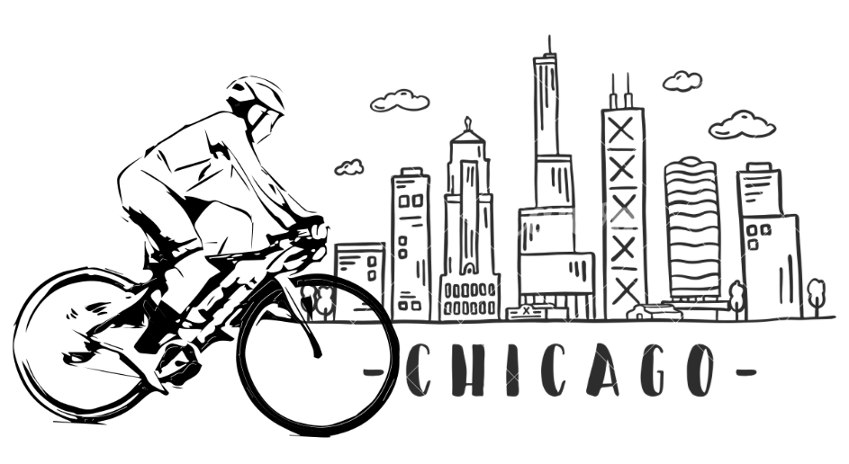
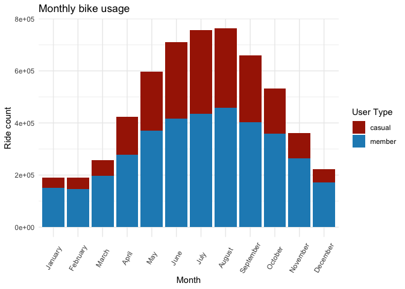
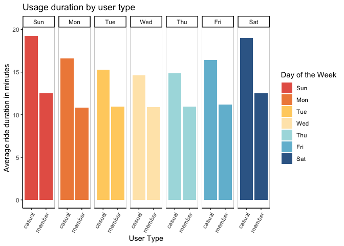
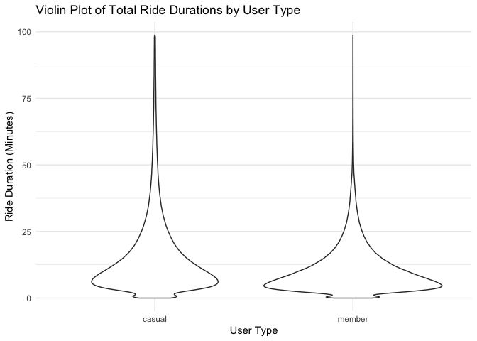

# Analysis of Cyclistic Bike Share Usage: A Comparative Study of bike usage by annual members and casual riders

Author: Aditi Nagaraj Nallan

## Introduction

The following report provides an in-dept analysis of bike usage patterns of Cyclistic, a fictional bike-share company based in Chicago! This analysis is for case study 1 from the Google Data Analytics Capstone project (Cyclistic). 

The primary focus of this project lies in understanding the differences in usage between annual members and casual riders. The main goal of the project is to understand these differences and provide recommendations to the executive team and help maximize the number of annual members which will be key to the future growth of the company. 

## Data Collection and Wrangling

Rider data aggregated from January through September 2023, was obtained from the original case study "'Sophisticated, Clear, and Polished’: Divvy and Data Visualization" written by Kevin Hartman (found here: https://artscience.blog/home/divvy-dataviz-case-study). The data has been made available by Motivate International Inc. under this [license](https://www.divvybikes.com/data-license-agreement). 

The datasets for each month were concatenated together and essential features such as ride duration and day of the week were computed for comparitive analysis.

## Descriptive Analysis

The initial exploration of September revealed key differences in the behavior of annual members and casual riders. Particularly, casual riders exhibited longer ride durations compared to annual members. These differences prompted an expanded analysis across multiple months.

## Data Visualization and Insights

### Ride Volume Analysis
A visual representation of the monthly ride counts highlighted the seasonality in bike usage. There was an evident increase in the number of rides during the warmer months, peaking in July and August. Interestingly, casual riders showed minimal activity during colder months, suggesting a preference for more favorable weather conditions. A higher activity in warmer months could also be an indication of tourist influx and majority of the casual riders being tourists to the city during these months. 

### Comparative Usage Patterns
The weekly analysis accentuated distinct patterns between members and casual riders. While members consistently used the service throughout the week, casual riders were predominantly active during weekends, especially on Saturdays. This insight could indicate differing motivations, such as commuting to work (members) versus leisure (casual riders).

### Duration of Rides
In alignment with our initial findings, casual riders consistently had longer ride durations across all days of the week. This consistent behavior was also observed throughout the year and underscores a fundamental difference in the usage pattern between the two user groups. While members might be utilizing the service for regular, shorter trips (potentially including commuting), casual riders seem to engage with the service more sporadically and for extended periods, possibly for leisurely exploration or less frequent, planned outings.

## Key Findings and Recommendations

### Seasonal Variations: 
The stark difference in seasonal usage between casual riders and members suggests a potential to introduce weather-appropriate promotional activities. Casual users could be targeted with winter promotions, encouraging ride usage even during colder months.

### Usage Purpose and Patterns: 
The difference in the days of high activity between user types implies differing use cases. Members might be using the service for daily commuting, while casual riders seem more leisure-oriented. Tailoring features or subscription plans catering to these distinct needs could enhance user experience and potentially convert casual riders to committed members.

### Ride Durations: 
The consistently longer ride durations of casual riders present an opportunity for tiered pricing strategies. 

## Conclusion and future analysis 

There are behavioral differences between Cyclistic's annual members and casual riders particularly with respect to variances in ride frequency, duration, and seasonal preference. Addressing these differences through targeted marketing, tailored subscription plans, and dynamic pricing could not only enhance user satisfaction but also boost the company's revenue by converting casual riders into loyal, annual members. 

Further analysis is yet to come which will also explore geographical usage patterns to provide suggestions on optimizing bike station locations and address regional demand effectively. Additionally, I plan to analyze yearly data from 2020-2023 to understand the seasonality trends more effectively. 

